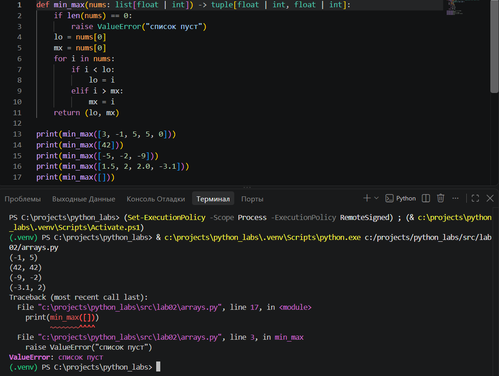
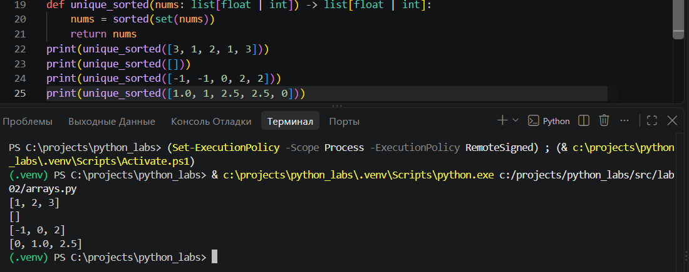
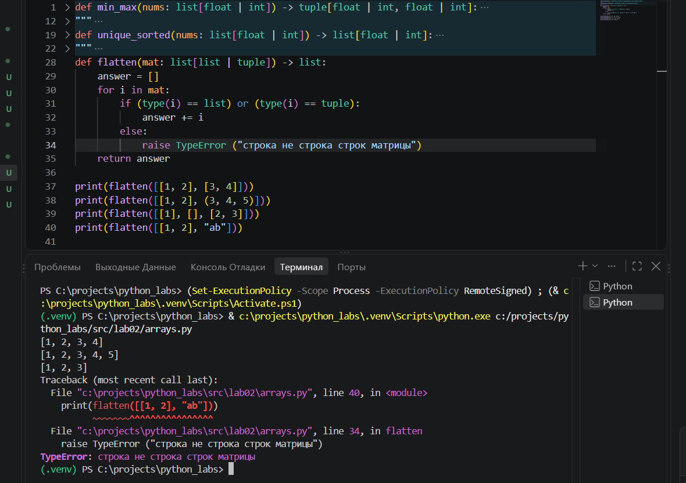
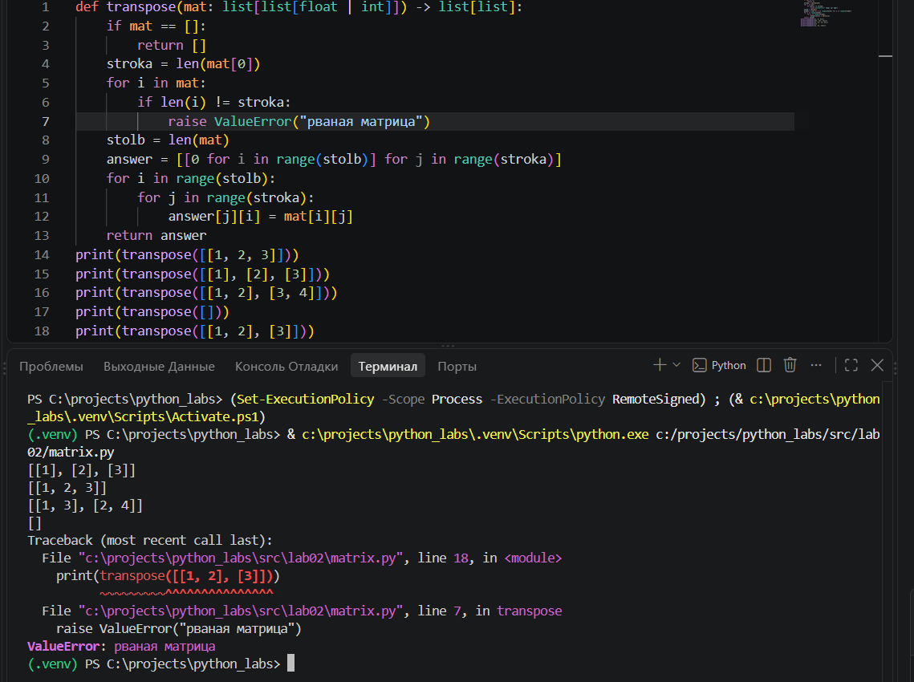
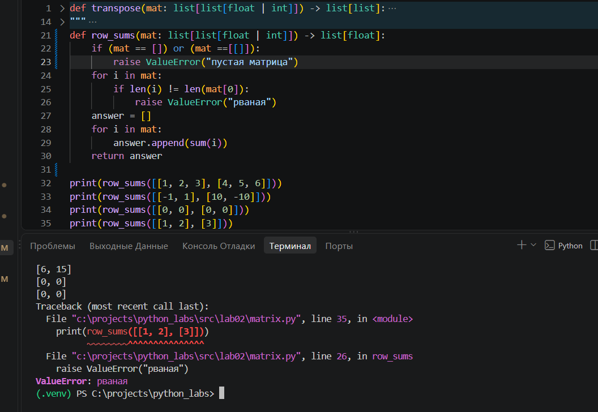
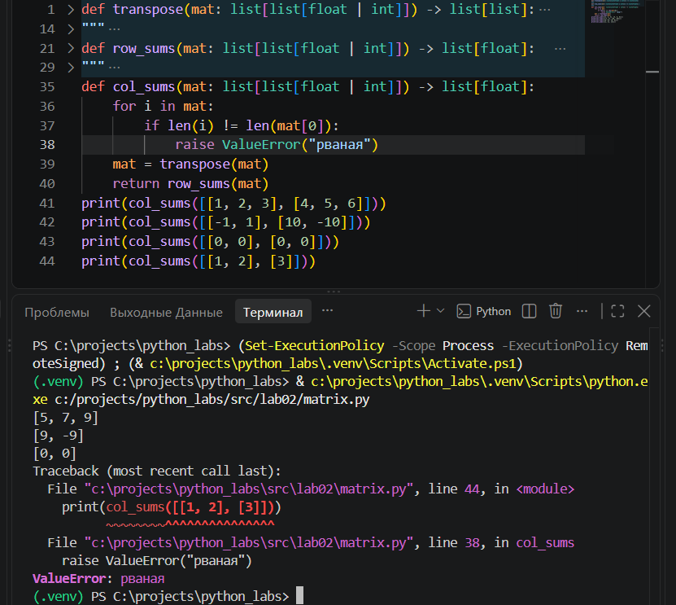
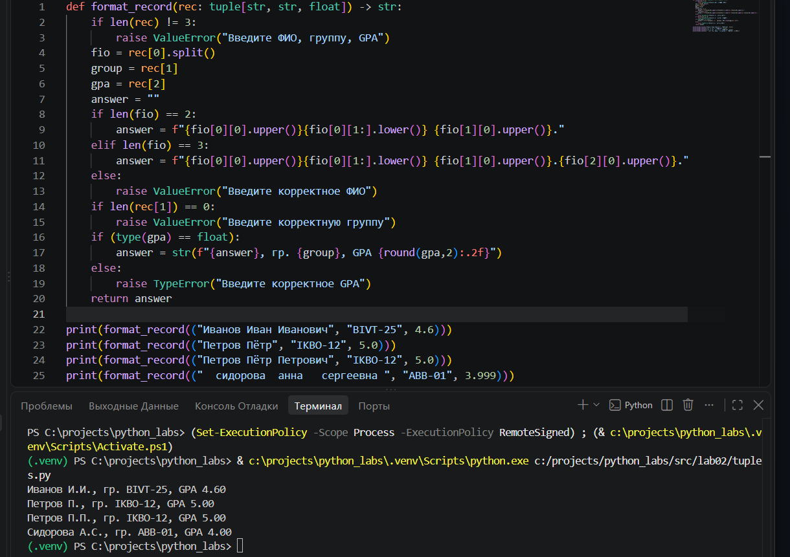

# Лабораторная работа №1 - Ввод/вывод и форматирование

## задание 1
Поздоровались и вывели возраст человека через год.

## задание 2
Вывели сумму и среднее значение.

## задание 3
Воспользовались формулой и вывели Чек: скидку и НДС.

## задание 4
Перевели время из минут в часы и минуты в формате ЧЧ:ММ.

## задание 5
Убрали лишние пробелы, вывели инициалы и посчитали длину исходной строки без лишних пробелов.

## задание 6
Посчитали количество учеников на заочной и очной форме обучения.

## задание 7
Восстановили верную строку по алгоритму.

# Лабораторная работа №2 - Коллекции и матрицы (list/tuple/set/dict)

## Задание 1
Написал три функции:

Эта функция находит минимальный и максимальный элементы списка.

Эта функция возвращает отсортированный список уникальных значений (по возрастанию).

Эта функция «расплющивает» список списков/кортежей в один список по строкам. 

## Задание 2 
Написал три функции:

Эта функция меняет строки и столбцы местами.

Эта функция считает сумму по каждой строке

Эта функция считает сумму по каждому столбцу

## Задание 3
Функция обрабатывает данные вида: «Фамилия Имя Отчество, группа, GPA»

