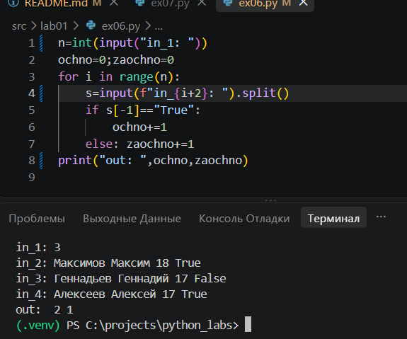
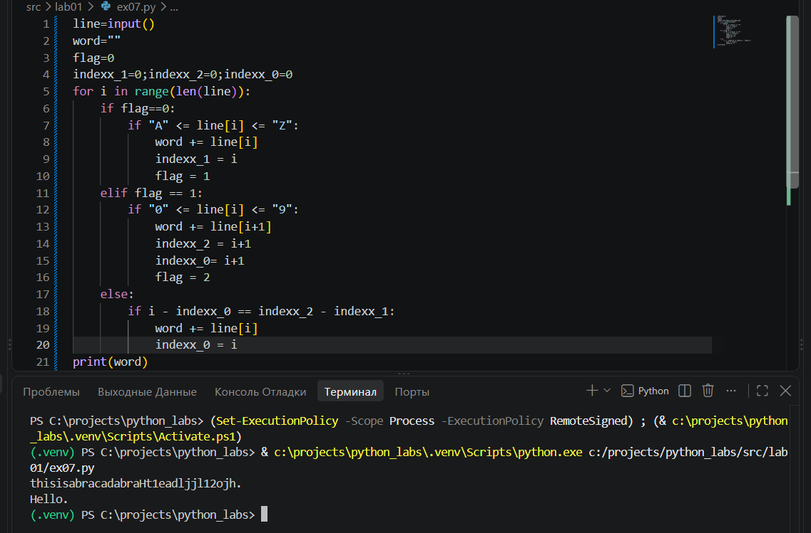

# Лабораторная работа №1 - Ввод/вывод и форматирование

## задание 1
Поздоровались и вывели возраст человека через год.

## задание 2
Вывели сумму и среднее значение.

## задание 3
Воспользовались формулой и вывели Чек: скидку и НДС.

## задание 4
Перевели время из минут в часы и минуты в формате ЧЧ:ММ.

## задание 5
Убрали лишние пробелы, вывели инициалы и посчитали длину исходной строки без лишних пробелов.

## задание 6
Посчитали количество учеников на заочной и очной форме обучения.

## задание 7
Восстановили верную строку по алгоритму.
