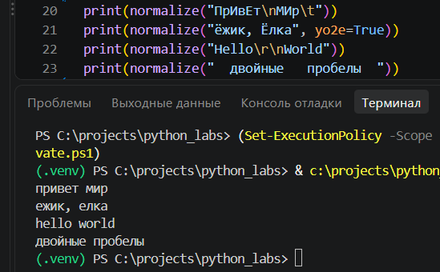
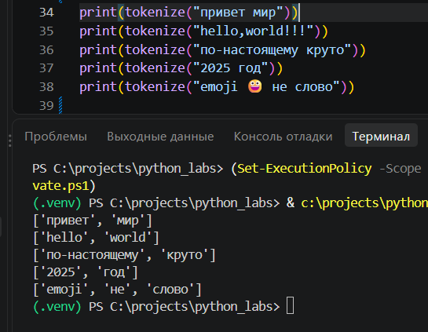
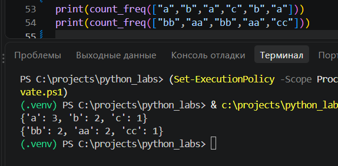
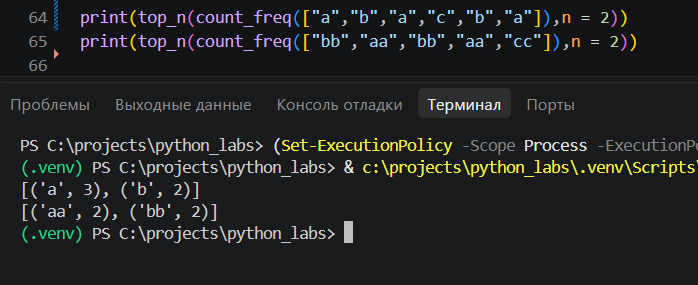
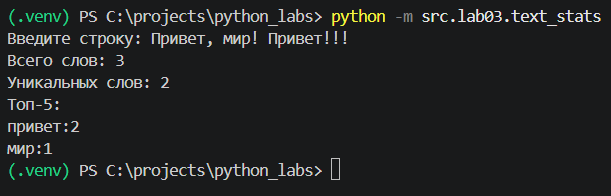
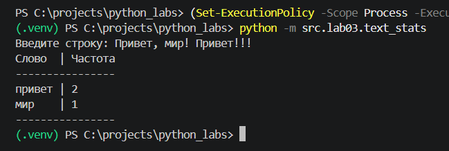

# Лабораторная работа №3 - Тексты и частоты слов (словарь/множество)

## Задание A — src/lib/text.py

### normalize

Нормализация. Преобразование строки s в norm(s):
    1. Заменяет все ё/Ё на е/Е
    2. Заменяет управляющие символы \t, \r, \n на пробел
    3. «схлопывает» последовательности пробелов в один и обрезает края (strip)

```Python
def normalize(text: str, *, casefold: bool = True, yo2e: bool = True) -> str:
    """
    Нормализация. Преобразование строки s в norm(s):
    1. Заменяет все ё/Ё на е/Е
    2. Заменяет управляющие символы \t, \r, \n на пробел
    3. «схлопывает» последовательности пробелов в один и обрезает края (strip)
    """
    text = text.replace("\t"," ")
    text = text.replace("\r"," ")
    text = text.replace("\n"," ")
    if yo2e:
            text = text.replace("ё", "е")
            text = text.replace("Ё","Е")
    if casefold:
        text = text.casefold()
    text = " ".join(text.split())
    return text.strip()
```



### tokenize

Токенизация. Множество слов — это все подстроки, удовлетворяющие шаблону \\w+(?:-\\w+)*
(буквы/цифры/подчёркивание; допускается дефис внутри слова), разделённые любыми не-\\w символами.

```Python
def tokenize(text: str) -> list[str]:
    """
    Токенизация. Множество слов — это все подстроки, удовлетворяющие шаблону
    \\w+(?:-\\w+)*
    (буквы/цифры/подчёркивание; допускается дефис внутри слова), разделённые любыми не-\\w символами.
    """
    tokens = re.findall(r"\w+(?:-\w+)*", text)
    return tokens
```



### count_freq

Частоты. Для списка токенов T = [t₁, …, tₙ] частота слова w равна f(w) = |{ i : tᵢ = w }|.

```Python
def count_freq(tokens: list[str]) -> dict[str, int]:
    """
    Частоты. Для списка токенов T = [t₁, …, tₙ] частота слова w равна
    f(w) = |{ i : tᵢ = w }|.
    """
    freq = {}
    for i in tokens:
            if i in freq:
               freq[i] += 1
            else:
                 freq[i] = 1
    return freq
```



### top_n

Топ-N. Отсортировывает пары (слово, частота) по ключу
(-частота, слово) и берёт первые N.

```Python
def top_n(freq: dict[str, int], n: int = 5) -> list[tuple[str, int]]:
    """
    Топ-N. Отсортировывает пары (слово, частота) по ключу
    (-частота, слово) и берёт первые N.
    """
    sort_freq = sorted(freq.items(), key=lambda x: (-x[1],x[0]))
    return sort_freq[:n]
```



## Задание B — src/text_stats.py (скрипт со stdin)

Скрипт читает текст из stdin, нормализует и токенизирует его с помощью функций из модуля text.py, считает общее количество слов, количество уникальных слов и выводит топ-5 самых частых слов. Добавлена возможность вывода красивой таблички(переменная tablet).

```Python
from src.lib.text import normalize, tokenize, count_freq, top_n
stroka = input("Введите строку: ")
tablet = "1"
norm = normalize(stroka)
worlds = tokenize(norm)
unique_worls = count_freq(worlds)
top_5 = top_n(unique_worls)
if tablet:
   max_len = max([len(i[0]) for i in top_5])
   if max_len > 5:
        print("Слово"+" "*(max_len - 4)+"|"+" Частота")
        print("-"*(10 + max_len))
        for i in top_5:
            print(f"{i[0]:<{max_len}} | {i[1]}")
        print("-"*(10 + max_len))
   else:
       print("Слово | Частота")
       print("-"*15)
       for i in top_5:
            print(f"{i[0]:<{max_len}} | {i[1]}")
       print("-"*(10 + max_len))
   
else:
    print(f"Всего слов: {len(worlds)}")
    print(f"Уникальных слов: {len(unique_worls)}")
    print("Топ-5:")
    for i in top_5:
        print(f"{i[0]}:{i[1]}")
```





### Как запустить

Вручную, с клавиатуры. В терминале из корня репозитория ввести: 

```Python
python -m src.lab03.text_stats
```